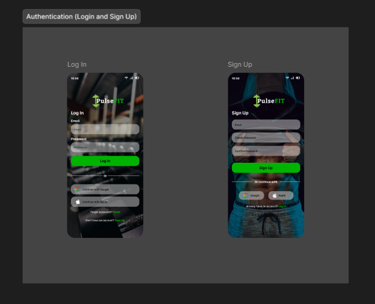
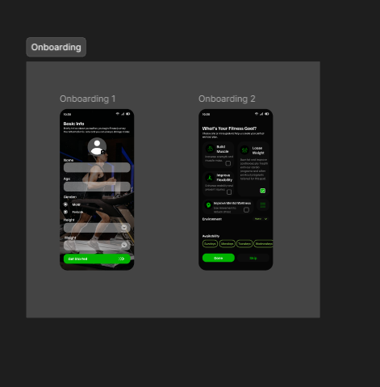
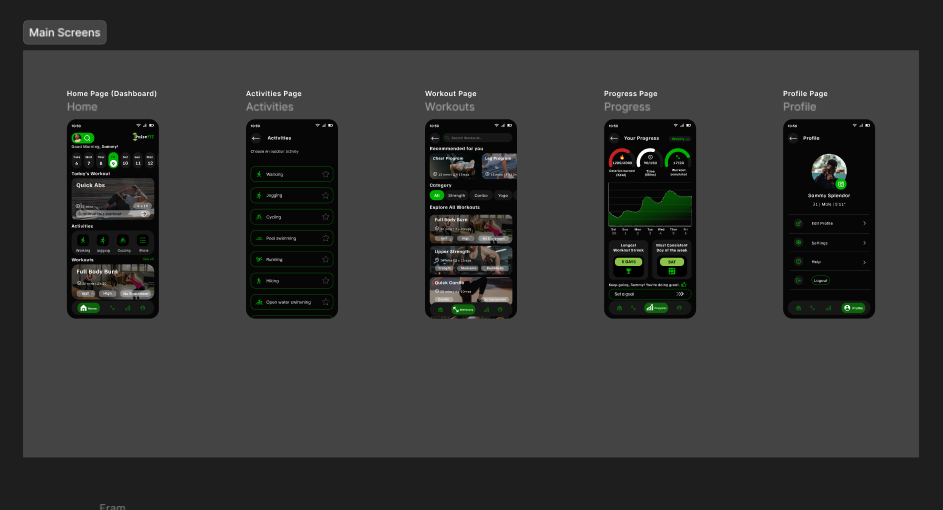
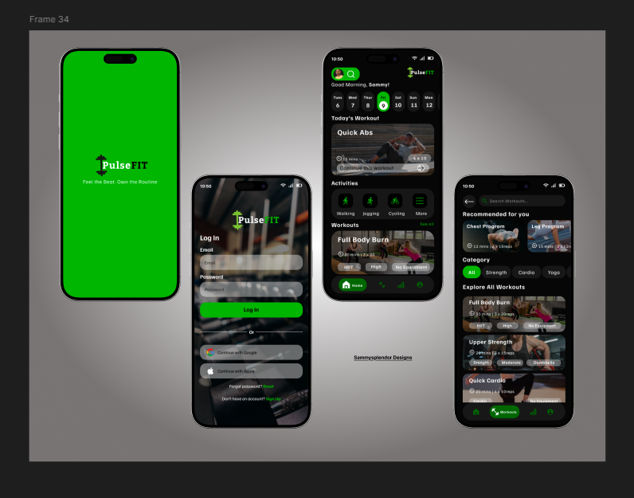

# Pulse_Fit Implementation Roadmap

## Goal Description

Build the complete **Pulse_Fit** application matching the provided high-fidelity dark mode designs. This includes connecting the authentication flow to the backend and implementing the 5 main tab screens with rich UI/UX (Glassmorphism, Green Accents #00FF00).

## Design References

````carousel

<!-- slide -->

<!-- slide -->

<!-- slide -->

<!-- slide -->

````

## User Review Required
>
> [!IMPORTANT]
> **Dependencies**: We will install `axios` (API), `expo-secure-store` (Auth), `react-native-svg` (Charts/Icons), and `@react-navigation/bottom-tabs`.

## Proposed Changes

### Phase 1: Foundation & Auth (Immediate)

1. **Dependencies**: Install `axios`, `expo-secure-store`.
2. **Service Layer**:
    - `services/api.ts`: Centralized Axios client with JWT interceptors.
    - `context/AuthContext.tsx`: Manage User Session.
3. **Integrate Auth Screens**:
    - Wire up `LoginScreen` and `SignupScreen` to the API.

### Phase 2: Navigation & Shell

1. **Bottom Tab Navigator**:
    - Implement the custom tab bar floating effect from the design.
    - Icons: Home, Activities, Workouts, Progress, Profile.
    - Active State: Green (#00FF00) icon + label.

### Phase 3: Main Screens Implementation

#### [NEW] [HomeScreen.tsx](file:///c:/Users/Paradox-Labs/Documents/Projects/Pulse_Fit/frontend/screens/HomeScreen.tsx)

- **Header**: User greeting + Notification bell.
- **Weekly Calendar**: Horizontal scroll of days.
- **Quick Workout Card**: "Quick Abs" with image background.
- **Categories**: "Walking", "Jogging", etc.

#### [NEW] [ActivitiesScreen.tsx](file:///c:/Users/Paradox-Labs/Documents/Projects/Pulse_Fit/frontend/screens/ActivitiesScreen.tsx)

- List of activity types with dark glassmorphism cards.
- Star/Favorite functionality.

#### [NEW] [WorkoutsScreen.tsx](file:///c:/Users/Paradox-Labs/Documents/Projects/Pulse_Fit/frontend/screens/WorkoutsScreen.tsx)

- **Search Bar** with green accent.
- **Featured Programs**: "Chest Program", "Leg Program".
- **Category Pills**: "All", "Strength", "Cardio", "Yoga".

#### [NEW] [ProgressScreen.tsx](file:///c:/Users/Paradox-Labs/Documents/Projects/Pulse_Fit/frontend/screens/ProgressScreen.tsx)

- **Charts**: Line chart for "Calories burned" or "Time spent".
- **Stats Grid**: Circular progress for daily goals.
- **Streaks**: "5 Days" count.

#### [NEW] [ProfileScreen.tsx](file:///c:/Users/Paradox-Labs/Documents/Projects/Pulse_Fit/frontend/screens/ProfileScreen.tsx)

- Profile picture with edit badge.
- Settings menu list.

## Verification Plan

1. **Auth**: Verify Login/Signup connects to backend.
2. **Navigation**: Verify tab switching and animation.
3. **Visual Regression**: Compare implemented screens against the embedded design images for pixel perfection (padding, colors, fonts).
